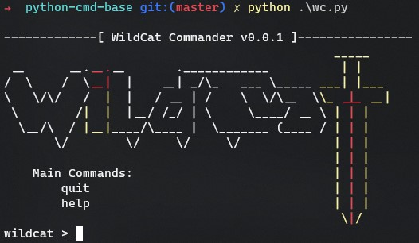

# python-cmd-base

A base for writing python command line programs.

### Prerequisites

Install dependencies

```python
pip3 install -r requirements.txt
```

Run

```python
python3 wc.py
```

Have fun :>


